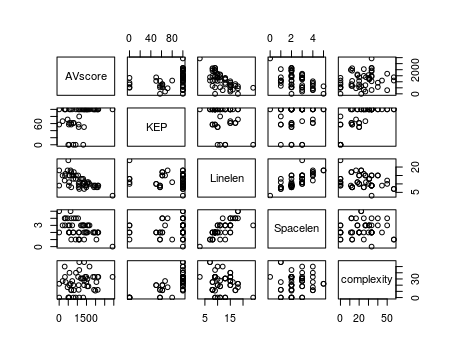

# chat-python

It is a typing practice through the file of the 'lyrics.txt'  
And analyzes the content of the typing.
> Changing the file 'lyrics.txt' will change the typing content.

### main.py
Allows you to type the contents of the file 'lyrics.txt' line by line.  
calculate typing time and length by one line, record the result in 'Score-record.txt' file.
> Repeatedly, you will know your score better.

### test.py
Save scores and information about 'lyrics.txt', in 'Statistical_Value.csv'  

#### AnalysisScore.py
Returns the average score of the file 'lyrics.txt'.

#### AnalysisLyrics.py
Save the data below in the file 'Statistical_Value.csv'.
- Typing score from 'AnalysisScore.py'
- Number of characters in line
- The ratio of Korean to English
- Number of spaces
- The number of characters with a foot (complexity)

#### R
  
Analyze the 'Statistical_Value.csv' file, analyze the relationship between the data obtained from 'AnalysisLyrics.py' and the typing score.
  

#### Forward
If you know what you're missing, you can learn that part.  
Learning the insufficient part can offset the insufficient part.  
Now this is a trivial conclusion, but this program will change.
